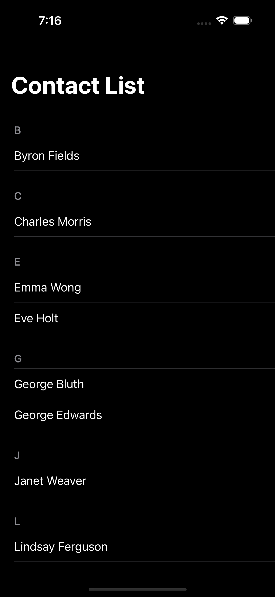
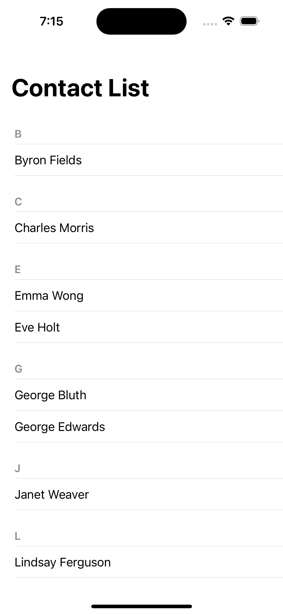

# Simple ContactList
- Use data from https://reqres.in/ for JSON-REST API
- Persist contacts data offline using any database
- Use MVVM Pattern
- Show a list of contact persons
- Show a detail view of the contact after tapping a contact

## Screenshots

  
  
  

